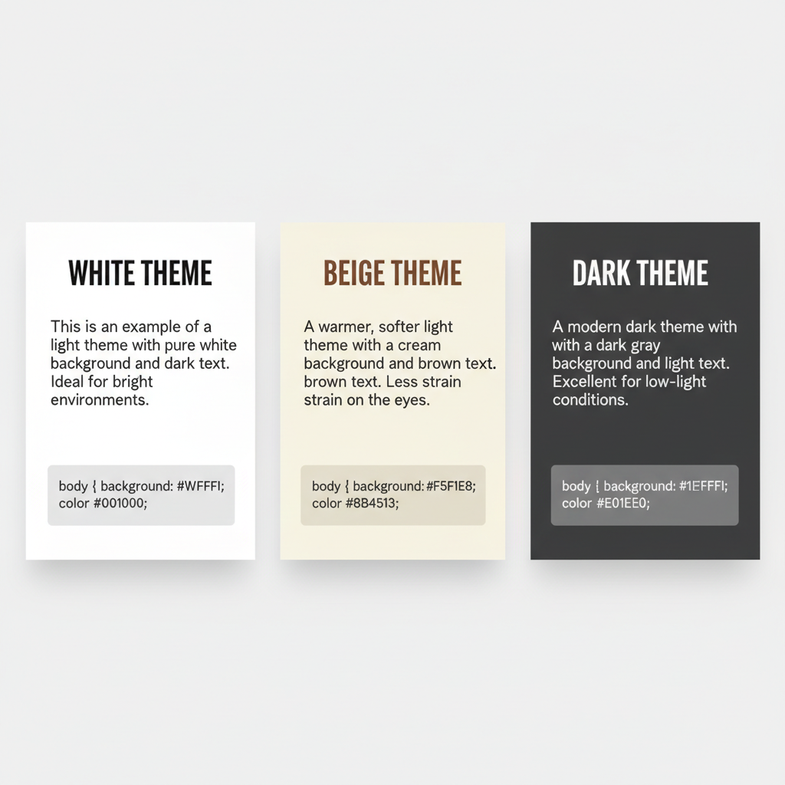
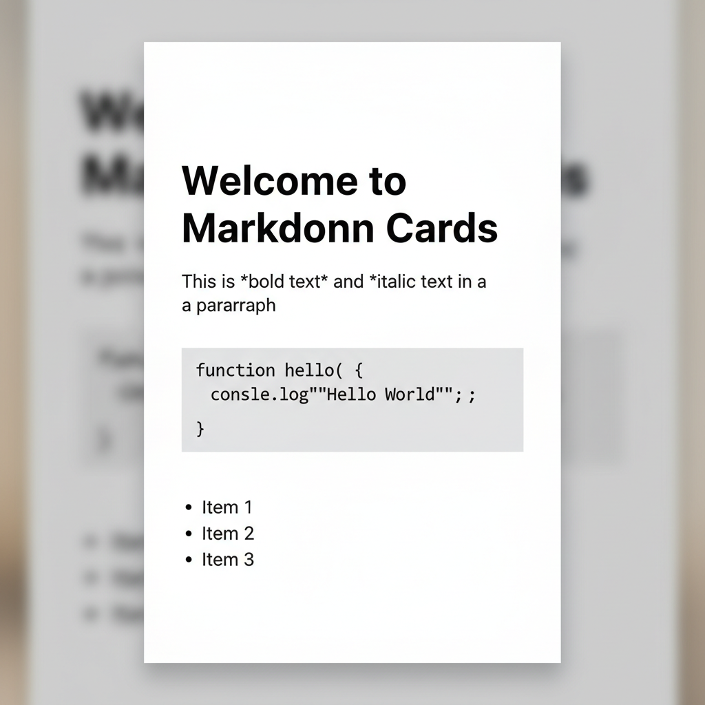
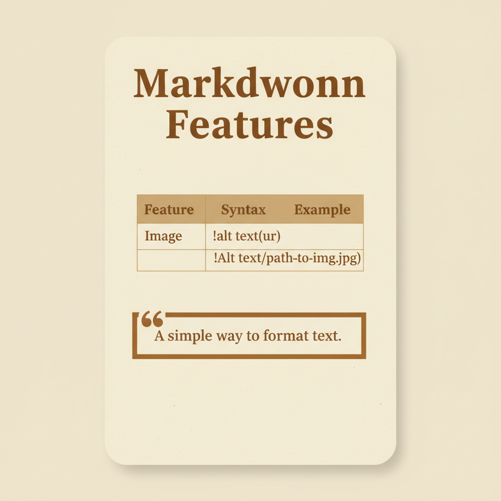
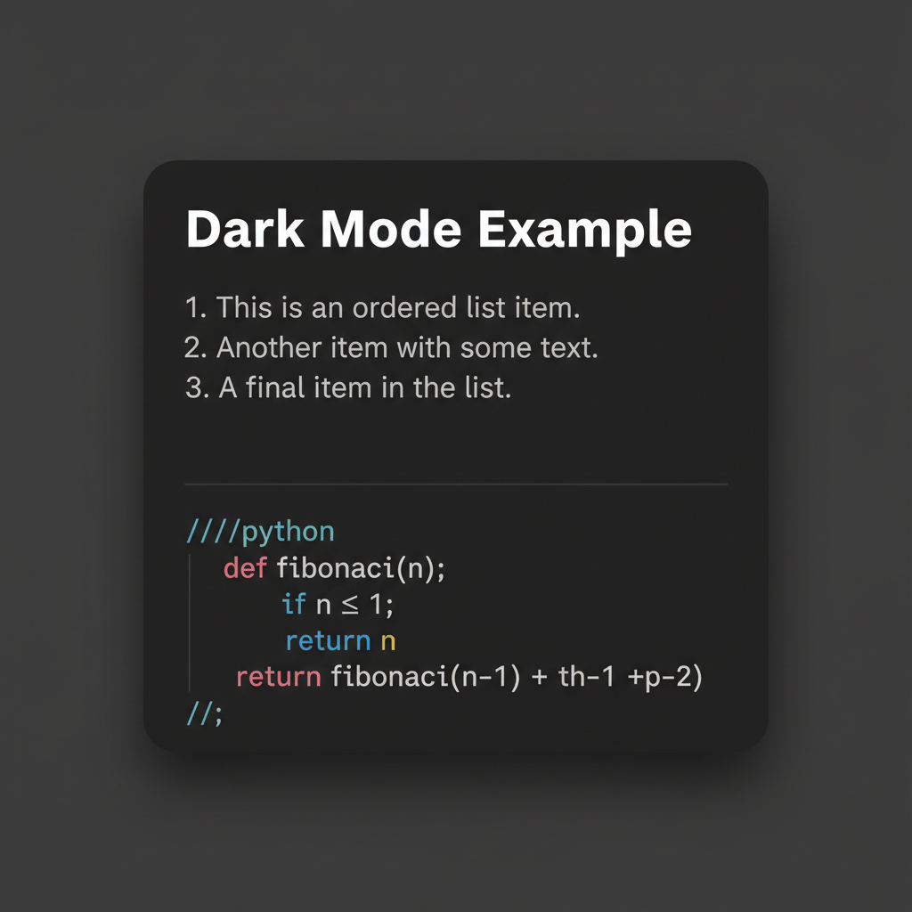

# Markdown to Image Cards Generator

Convert Markdown files into beautiful image cards with full format support and intelligent pagination.

[English](./README.md) | [中文文档](./README.zh-CN.md)

## Theme Showcase



### White Theme


### Beige Theme


### Dark Theme


## Features

- 📝 **Full Markdown Support**: Bold, italic, code blocks, lists, tables, blockquotes
- 🎨 **3+ Color Themes**: White, Beige, Dark, Blue
- 📏 **Fixed Size**: 1440×2400px (perfect for social media)
- 🔤 **Smart Layout**: Auto line-wrap, intelligent pagination, code block auto-scaling
- 🖼️ **Image Support**: Local and remote images with auto-scaling
- 💻 **Code Highlighting**: Code blocks with gray background and monospace font
- 📊 **Table Support**: Full table rendering with borders and zebra stripes
- 🌍 **Multi-language**: Optimized for both English and Chinese fonts

## Installation

```bash
npm install
```

First installation will download Puppeteer and Chromium (~170MB).

## Usage

```bash
# Generate image cards from Markdown file
node src/index.js --markdown document.md --theme white --output ./cards

# Use different themes
node src/index.js --markdown document.md --theme beige

# Direct text input (plain text mode)
node src/index.js --title "Title" --content "Content" --theme white
```

### Parameters

| Parameter | Description | Default |
|-----------|-------------|---------|
| `-m, --markdown <file>` | Markdown file path (recommended) | - |
| `-t, --title <text>` | Title text (plain text mode) | - |
| `-c, --content <text>` | Content text (plain text mode) | - |
| `--theme <name>` | Theme: `white`, `beige`, `dark`, `blue` | `white` |
| `-o, --output <dir>` | Output directory | `output` |

## Markdown Support

| Feature | Details |
|---------|---------|
| **Text Formatting** | Bold, italic, inline code |
| **Code Blocks** | Syntax highlighting, auto-wrap, auto font-size scaling |
| **Lists** | Ordered and unordered, with auto indentation |
| **Tables** | Full borders, gray header, zebra stripes |
| **Blockquotes** | Styled with left border |
| **Headings** | H1-H6 with auto font-size |
| **Images** | Local & remote, auto download/cache, proportional scaling |

### Smart Pagination

- Code blocks, lists, and tables are treated as atomic units (won't be split)
- Regular paragraphs are intelligently split at natural breakpoints
- Auto pagination at periods, line breaks, etc.

## Color Themes

| Theme | Background | Text Color | Style |
|-------|------------|------------|-------|
| white | #FFFFFF | #1A1A1A | Clean & minimal |
| beige | #F5F1E8 | #5C4A3A | Vintage & warm |
| dark  | #1E1E1E | #E8E8E8 | Dark mode |
| blue  | #E8F4F8 | #2C5F7C | Fresh blue |

## Use as Claude Code Skill

This project includes a `2xhs-card` skill for direct use in Claude Code:

```
Convert this Markdown file to image cards
```

Claude will automatically recognize and invoke this tool.

## Tech Stack

- **Puppeteer** - Browser automation (high-quality rendering)
- **Marked** - Markdown parsing
- **github-markdown-css** - GitHub-style CSS
- **Commander.js** - CLI argument parsing
- **Chalk** - Colored terminal output

## FAQ

**Q: Code blocks not wrapping?**
A: Fixed. Code blocks auto-wrap, and long code auto-scales font size.

**Q: Tables not displaying?**
A: Ensure standard Markdown table syntax. Full table rendering is supported.

**Q: First installation is slow?**
A: Puppeteer needs to download Chromium (~170MB). Ensure stable network.

**Q: How to customize colors?**
A: Edit `src/themes.js` and add new theme configurations.

## License

MIT

## Contributing

Issues and Pull Requests are welcome!
