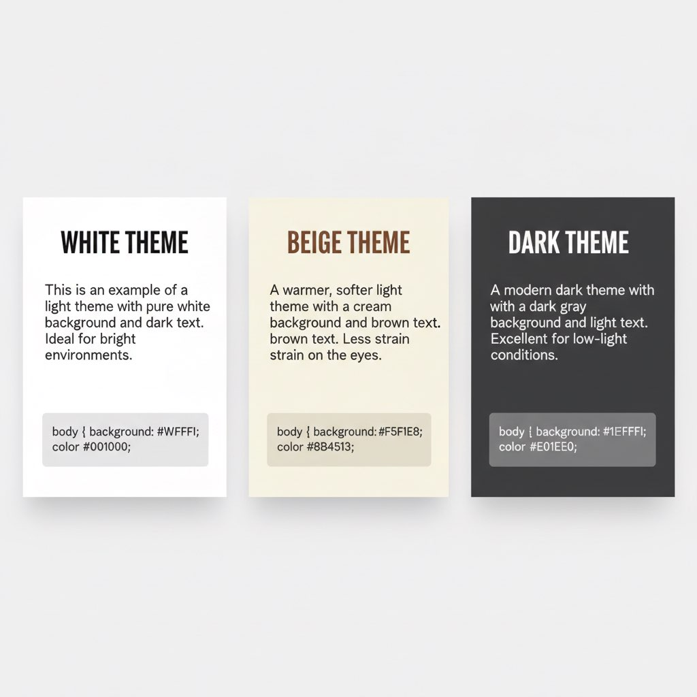
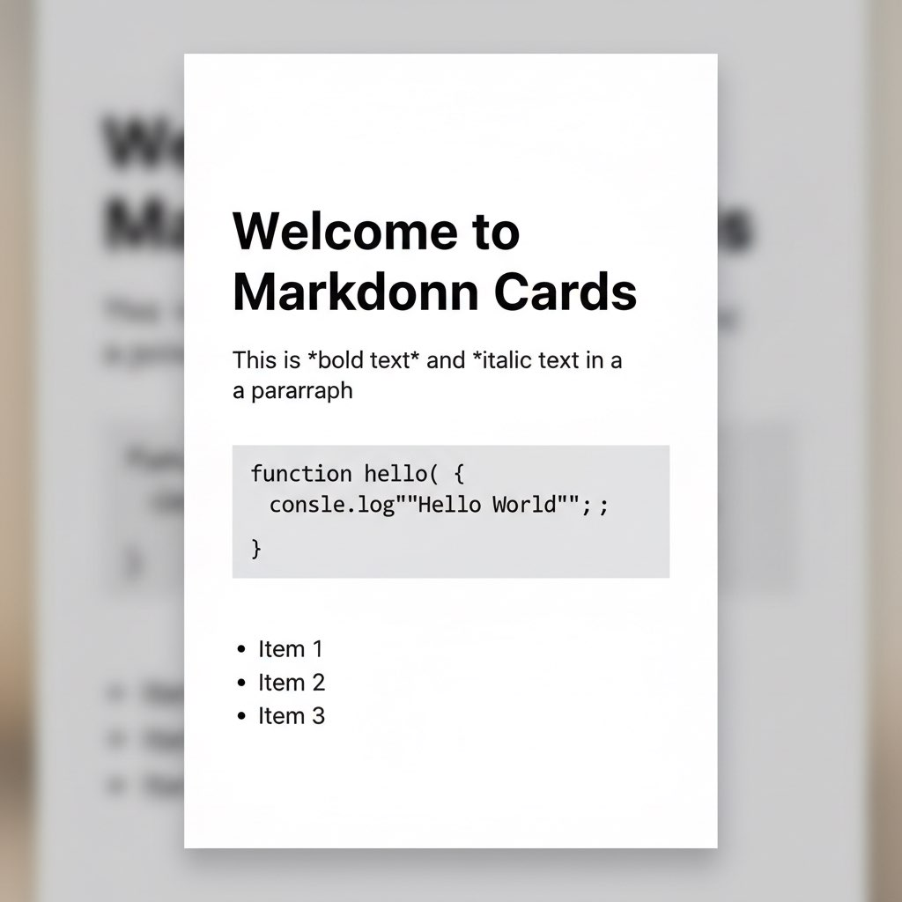
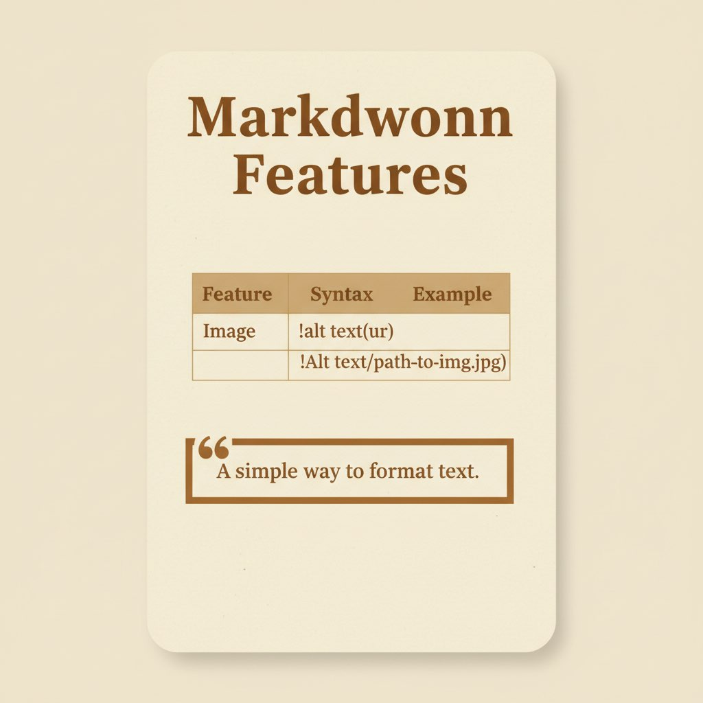
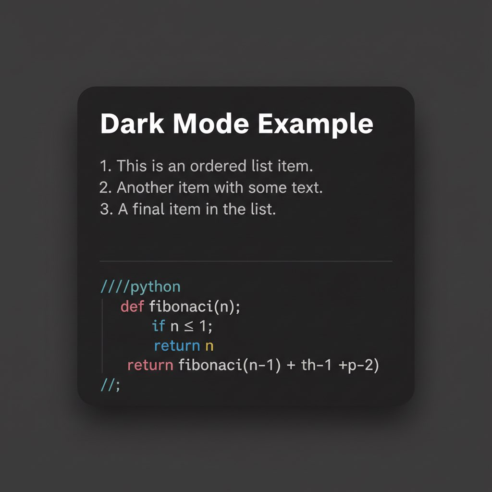

# Markdown to Image Cards Generator

将 Markdown 文件转换为精美的图片卡片，支持完整的 Markdown 格式和智能分页。

[English](./README.md) | [中文文档](./README.zh-CN.md)

## 主题展示



### 白色主题


### 米色主题


### 深色主题


## 功能特点

- 📝 **完整 Markdown 支持**：粗体、斜体、代码块、列表、表格、引用
- 🎨 **3+ 种配色主题**：白色、米色、深色、蓝色
- 📏 **固定尺寸**：1440×2400px（适合社交媒体分享）
- 🔤 **智能排版**：自动换行、智能分页、代码块自动缩放
- 🖼️ **图文混排**：支持本地和远程图片，自动等比例缩放
- 💻 **代码高亮**：代码块带灰色背景和等宽字体
- 📊 **表格支持**：完整的表格渲染，带边框和斑马纹
- 🇨🇳 **中文优化**：完美支持中文字体渲染

## 安装

### 作为独立工具安装

```bash
git clone https://github.com/bluemomo112/markdown-to-image-cards.git
cd markdown-to-image-cards
npm install
```

首次安装会下载 Puppeteer 和 Chromium（约 170MB），请耐心等待。

### 作为 Claude Code Skill 安装

**一键安装：**

```bash
curl -fsSL https://raw.githubusercontent.com/bluemomo112/markdown-to-image-cards/main/install-skill.sh | bash
```

**手动安装：**

```bash
# Clone 到 skill 目录
git clone https://github.com/bluemomo112/markdown-to-image-cards.git ~/.agents/skills/2xhs-card
cd ~/.agents/skills/2xhs-card && npm install

# 创建 skill 注册
mkdir -p ~/.claude/skills/2xhs-card
# 复制并编辑 SKILL.md，使用绝对路径（参考 install-skill.sh）
```

安装后，在 Claude Code 中使用：
```
把这个 Markdown 文件转换成图片卡片
```

## 使用方法

```bash
# 从 Markdown 文件生成图片卡片
node src/index.js --markdown document.md --theme white --output ./cards

# 使用不同主题
node src/index.js --markdown document.md --theme beige

# 直接输入文字（纯文本模式）
node src/index.js --title "标题" --content "内容" --theme white
```

### 参数说明

| 参数 | 说明 | 默认值 |
|------|------|--------|
| `-m, --markdown <file>` | Markdown 文件路径（推荐） | - |
| `-t, --title <text>` | 标题文本（纯文本模式） | - |
| `-c, --content <text>` | 正文内容（纯文本模式） | - |
| `--theme <name>` | 主题：`white`、`beige`、`dark`、`blue` | `white` |
| `-o, --output <dir>` | 输出目录 | `output` |

## Markdown 支持

| 功能 | 详情 |
|------|------|
| **文本格式** | 粗体、斜体、行内代码 |
| **代码块** | 语法高亮、自动换行、字体自动缩放 |
| **列表** | 有序和无序列表，自动缩进 |
| **表格** | 完整边框、灰色表头、斑马纹 |
| **引用** | 带左边框样式 |
| **标题** | H1-H6，自动调整字体大小 |
| **图片** | 本地和远程图片，自动下载/缓存，等比缩放 |

### 智能分页

- 代码块、列表、表格作为原子单元，不会被截断
- 普通段落在自然断点处智能拆分
- 自动在句号、换行符等位置分页

## 配色主题

| 主题名 | 背景色 | 文字色 | 风格 |
|--------|--------|--------|------|
| white | #FFFFFF | #1A1A1A | 简约干净 |
| beige | #F5F1E8 | #5C4A3A | 复古温暖 |
| dark  | #1E1E1E | #E8E8E8 | 暗黑模式 |
| blue  | #E8F4F8 | #2C5F7C | 清新蓝 |

## 作为 Claude Code Skill 使用

已包含 `2xhs-card` skill，可在 Claude Code 中直接使用：

```
帮我把这个 Markdown 文件转换成图片卡片
```

Claude 会自动识别并调用此工具。

## 技术栈

- **Puppeteer** - 浏览器自动化（高质量渲染）
- **Marked** - Markdown 解析
- **github-markdown-css** - GitHub 风格样式
- **Commander.js** - 命令行参数解析
- **Chalk** - 终端彩色输出

## 常见问题

**Q: 代码块不换行？**
A: 已修复，代码块会自动换行，超长代码会自动缩小字体。

**Q: 表格不显示？**
A: 确保使用标准 Markdown 表格语法，已支持完整表格渲染。

**Q: 首次安装很慢？**
A: Puppeteer 需要下载 Chromium（约 170MB），请确保网络畅通。

**Q: 如何自定义配色？**
A: 编辑 `src/themes.js` 文件，添加新的主题配置。

## License

MIT

## 贡献

欢迎提交 Issue 和 Pull Request！
